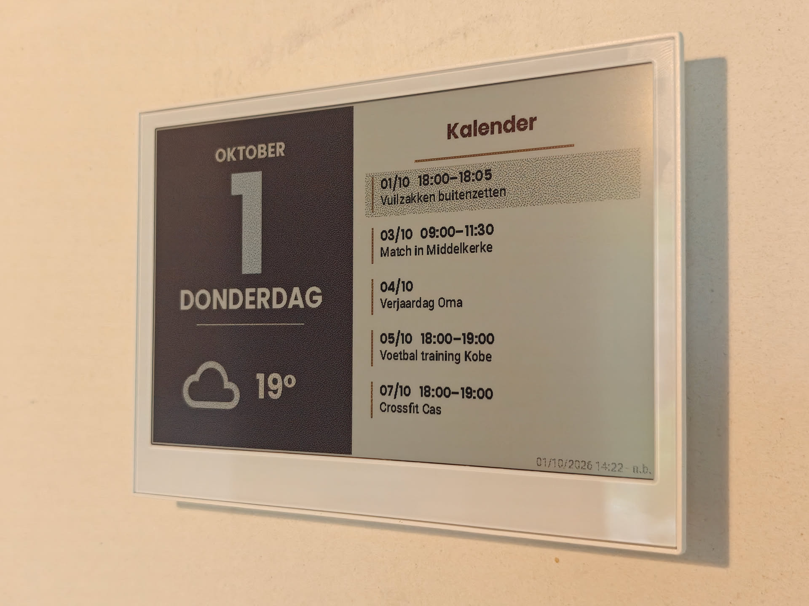
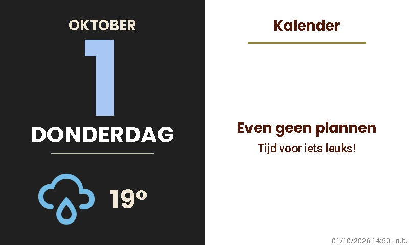

# DailyView

*A glanceable date, weather forecast and agenda for a color e-paper display.*

DailyView is a Home Assistant script for an **800 × 480, six-color Seeed reTerminal E1002 running OpenDisplay firmware**. It renders locally in Home Assistant and sends the finished frame over an active Bluetooth connection (or queues it for the next wake-up). The display does not contact the calendar or weather provider itself. The example retains the original Dutch on-screen copy; this documentation is in English.

### In use



*Physical display photographed with test calendar events. This shows an **earlier layout** with a longer agenda lookahead, not the exact current 72-hour output.*



*Newest generated `.local/` image: a dry-run of the empty-calendar message. The preview script still has the older 400 px left column and Burkes dithering, so it is not a pixel-for-pixel production render.*

```
Calendar(s) ─┐
              ├─ Home Assistant script → OpenDisplay drawcustom → queued frame → E1002
Weather ─────┘           ↑                                   ↑
                   four time triggers                 next deep-sleep wake
```

## Requirements

- **Hardware:** a Seeed reTerminal E1002 (800 × 480 color e-paper) running [OpenDisplay firmware](https://wiki.seeedstudio.com/EN04_opendisplay/), within range of a Bluetooth adapter or ESPHome proxy that supports **active BLE connections**. A passive-only proxy cannot upload frames.
- **Home Assistant 2026.7.0+** with the [OpenDisplay custom integration](https://github.com/OpenDisplay/Home_Assistant_Integration) installed (HACS or manual), configured for the display, and providing `opendisplay.drawcustom`. Home Assistant's built-in `opendisplay.upload_image` action alone is **not sufficient** for this script.
- **Data sources:** two working `calendar.*` entities for the example as written, and one `weather.*` entity supporting `weather.get_forecasts` with `type: daily` and a numeric forecast temperature. You can adapt the script for one calendar. The display's battery sensor is optional; without it, the footer shows `n.b.`.
- **Configuration:** access to Home Assistant scripts and automations, your own display device ID and entity IDs, and the display's BLE encryption key **if encryption is enabled**. Keep the key private. The bundled fonts need no separate download.

See the [step-by-step setup guide](docs/setup.md) for firmware installation, entity substitutions, validation and a dry-run preview.

## Develop offline

Use Python **3.11+** and [`odl-renderer==0.5.12`](requirements-preview.txt) to generate a local PNG directly from the layout templates in the YAML example—no Home Assistant connection or display required. On Windows, from this directory:

```powershell
python -m venv .venv
.venv/Scripts/python.exe -m pip install -r requirements-preview.txt
.venv/Scripts/python.exe preview.py --scenario busy --at 2026-10-01T09:00:00+02:00 --output .local/busy.png
.venv/Scripts/python.exe -m unittest discover -s tests -v
```

The `empty`, `today`, `busy` and `long-text` scenarios use synthetic data. You can also supply a JSON fixture or export the resolved ODL elements for tooling. See [offline preview and input format](docs/offline-preview.md), including macOS/Linux commands and the differences from a true E1002 render.

## Start here

1. [Set up hardware, integrations, entities and YAML](docs/setup.md).
2. [Understand the exact rendering logic and settings](docs/implementation.md).
3. [Operate, test and troubleshoot the display](docs/operations.md).
4. Adapt the complete, portable [script](examples/scripts.yaml) and [automation](examples/automations.yaml) to your own Home Assistant instance.
5. [Render and test with synthetic inputs offline](docs/offline-preview.md).

**Do not copy the example blindly.** Substitute your device ID and the two calendar, weather and battery entity IDs everywhere they appear (including Jinja dictionary keys); then validate and preview before enabling physical delivery. The example is intentionally stripped of device identifiers and credentials.

## What the current installation does

- Dark left column: Dutch month, day, weekday, today's **forecast maximum** and daily forecast condition icon.
- White right column: combined events from two calendars, **up to five events in the next rolling 72 hours**; events overlapping today receive a green background. With no events: “Even geen plannen / Tijd voor iets leuks!” centered below the heading.
- Footer: render time and battery percentage (`n.b.` when unavailable).
- Scheduled renders at **00:00, 06:00, 11:00 and 17:00**, in the Home Assistant local timezone.
- Production uses Floyd–Steinberg dithering, `fast` refresh and physical delivery. A separate dev script uses `dry-run: true` for previews. The existing dev script is **not pixel-for-pixel identical** to production: it retains the older 400 px left column, lighter green and Burkes dithering. For a faithful new installation, clone production and change only `dry-run` for the preview copy.

These are the observed settings of this particular installation, not defaults or requirements for other devices. As last checked, Home Assistant still reported **120 s deep sleep**, 40 s wake advertising/idle timeout, three missed cycles before marking unavailable and a 24-hour queue timeout. The owner's planned 1800 s sleep interval has **not** been verified as active; do not represent it as the live setting.

## Scope and security

This folder contains documentation and examples only. It is **not** a synchronized copy of `/config` and deploying these files does not change Home Assistant. Never commit your real device IDs, encryption keys, private calendar event data, Home Assistant tokens, `.storage`, `secrets.yaml`, or diagnostics. The physical photo above contains user-supplied test events included with permission. An earlier local preview tool (not included in this repository) rendered an obsolete design and is not part of DailyView's setup.
